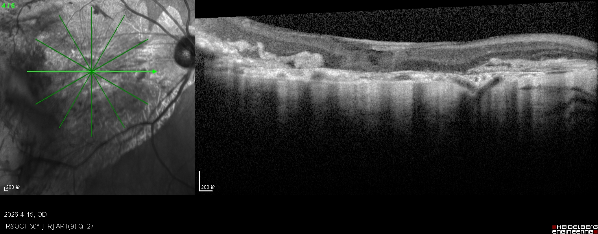
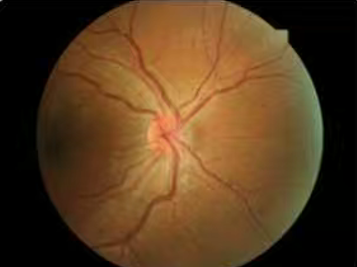
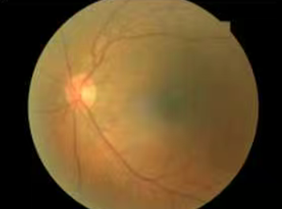

# 医疗大模型评测专项-眼科医疗大模型评测

## 一、评测总体介绍

本次“北京市医疗大模型评测专项”以眼科真实临床场景为核心，由国内权威眼科专家团队牵头设计，依托权威指南、真实临床病例、多模态医学图像与开放式场景任务组成的高质量评测数据集，对大模型进行体系化、量化、可复现的眼科能力测试。

评测体系基于 “五大场景 × 十三大能力维度”：

| 场景           | 能力                 |
| -------------- | -------------------- |
| 专科诊疗决策   | 专科专病随访能力     |
|                | 专科专病预后预测能力 |
|                | 专科辅助医嘱推荐能力 |
|                | 专科辅助治疗能力     |
|                | 专科辅助诊断能力     |
|                | 影像推理与质控能力   |
|                | 病理推理与质控能力   |
| 专科诊疗流程   | 专项沟通能力         |
| 医学合规伦理   | 医学伦理能力         |
|                | 医学合规能力         |
| 医学循证与知识 | 专科基础能力         |
|                | 专科科普能力         |
| 通用辅助能力   | 合理用药能力         |

评测结果将形成：基于评测结果，得到的模型或应用的能力报告

## 二、评测流程

以下为评测平台对参评模型执行的完整技术流程，适用于 **API 接入方式**。

- 客户端入口地址、测试账号、登录方式、使用指南
- 双方确认评测使用的模型版本、推理参数（temperature、max_tokens 等）并冻结

---

### 2.1 确认参评方式

- 确认参评机构采用的接入方式：
  - **API 接入评测**（优先推荐）
- 参评机构需提交必要的接入信息：
  - **API 接入测试需提交：**

    - 最小可运行的样例调用代码（Python）
    - 支持的模型参数说明（temperature / top_p / max_tokens 等）
    - 多模态必须说明图像编码格式（Base64 / URL / 自定义字段）
    - 若需导入第三方库，请说明**库名称与版本号**（如 `openai==1.52.0` 或 `requests==2.31.0`）
    - 示例样例调用代码：
    - #### ✅（一）单模态文本对话 API 样例（必须提供）
    - #### ✅ Python 示例（建议官方 OpenAI SDK 格式）
    - > **如果使用第三方库，请注明版本，例如：**
      >
    - > `openai==1.52.0`
      >

      ```python
      import json
      from openai import OpenAI

      API_KEY = "xxxxxx"
      BASE_URL = "https://your_api_host/v1"
      MODEL   = "your_model_name"
      client = OpenAI(api_key=API_KEY, base_url=BASE_URL)
      question = "请回答：1+1等于几？（连通性测试示例）"

      completion = client.chat.completions.create(
          model=MODEL,
          temperature=0.2,
          max_tokens=256,
          messages=[
              {"role": "user", "content": question}
          ]
      )

      resp = json.loads(completion.model_dump_json())
      print(resp["choices"][0]["message"]["content"])
      ```

      - #### ✅（二）多模态输入 API 样例（以Base64为例）

      ```python
      import base64
      import json
      from openai import OpenAI
      from PIL import Image  # Pillow==10.2.0
      import io

      API_KEY = "xxxxxx"
      BASE_URL = "https://your_api_host/v1"
      MODEL   = "your_multimodal_model"

      # 读取本地图片并转为 Base64
      def encode_image_to_base64(path):
          with Image.open(path) as img:
              buffer = io.BytesIO()
              img.save(buffer, format=img.format)
              img_bytes = buffer.getvalue()
          return base64.b64encode(img_bytes).decode("utf-8")

      image_b64 = encode_image_to_base64("sample_ct_image.png")

      client = OpenAI(api_key=API_KEY, base_url=BASE_URL)

      prompt = "请根据图像描述该肺部病灶的影像特征。（测试用）"

      completion = client.chat.completions.create(
          model=MODEL,
          temperature=0.2,
          max_tokens=512,
          messages=[
              {"role": "user", 
               "content": [
                  {"type": "text", "text": prompt},
                  {"type": "image_url", 
                   "image_url": {
                      "url": f"data:image/png;base64,{image_b64}"
                   }
                  }
               ]}
          ]
      )

      resp = json.loads(completion.model_dump_json())
      print(resp["choices"][0]["message"]["content"])

      ```

---

### 2.2 连通性测试

- 使用 **5–10 道样例题**（不包含正式评测题目）进行链路测试
- 验证 API 或网页端的稳定性：
  - 请求是否成功
  - JSON 响应结构是否符合样例规范
- 网页端需验证输入框、提交按钮、对话窗口、文件上传（如有）等可用性
- 连通性测试通过后方可进入全量评测阶段

---

### 2.3 模型评测

- **对参评模型推送本次评测的完整题集**：
  - 单选题、多选题
  - 开放式问答题
  - 多模态问答题（CT / PET / 病理图像等）
- **对所有模型回答进行统一格式化处理**：
  - 抽取选择题选项字母（A/B/C/D）
  - 清洗 Markdown/HTML 片段
  - 统一编码、统一换行格式
- **格式化后的结果进入评分模块**

---

### 2.4 评分与复核

- **选择题评分：**
  - 单选题：完全匹配得分
  - 多选题：漏选、多选均判错
- **开放式问答评分：**
  - 使用眼科专科裁判模型对每个评分点逐项比对
  - 自动生成 `obtained_score` 与 `scoring_flags`
- **危险建议扣分：**
  - 若模型生成违背指南、违反伦理或带来安全风险的建议，将触发扣分机制
- **专家抽审：**
  - 眼科专家组对推理类、决策类题目进行抽样审核
  - 对模型错误或裁判模型边界情况进行医学纠偏
- **场景 / 维度聚合：**
  - 按“五大场景 × 十三大能力维度”聚合得分

---

## 三、评测数据集

样例题展示（选择题 / 文本问答 / 多模态问答）

**题型1：选择题**

题目：

一名67岁男性患者，临床初步诊断为“新生血管性年龄相关性黄斑变性（nAMD）”，在接受连续4次规范化抗VEGF单药治疗后，结构OCT显示视网膜下积液（SRF）仅轻度吸收，且伴有持续存在的、形态陡峭的色素上皮脱离（PED）。作为带教医师，在讨论下一步“检查推荐”以优化诊疗决策时，下列哪项建议最能体现对该病例深度逻辑的把握？

A. 首选高分辨率OCTA检查，利用其无创、三维成像优势替代ICGA，通过观察血流信号的“圆顶状”突起直接确诊PCV并指导PDT治疗范围。

B. 首选吲哚青绿血管造影（ICGA），利用其近红外光穿透力及染料与蛋白结合的特性，识别早期高荧光息肉灶，以弥补OCTA对低流速息肉病灶检出率的不足，并界定PDT干预靶区。

C. ...

---

**题型2：多模态问答题**

病例描述：

患者，男性，80-89岁，因双眼反复视力下降就诊， 主诉及现病史：双眼约注药2月24.6.12，25.7.9月，25.12.25，26.2.13最后1针，左眼针，右眼针 既往史及过敏史：...

题目：

1. 影像质控评价：该影像质量是否合格？影像表现与病历文本中的眼底描述是否具有一致性？请说明理由。
2. 影像结构化解析：请精准描述该影像中黄斑区的解剖层次病变（需定位到具体层次）。
3. ...

 


评分要点：

1. 准确识别并指出病历描述（未见明显变化）与影像表现（严重病变）之间的图文矛盾 (+20分)
2. 精准定位病灶层次，包括视网膜内囊腔（IRF）、视网膜下积液（SRF）及RPE层异常 (+15分)
3. ...

---

**题型3：文本问答题**

病例描述：

在老年性黄斑变性（AMD）的临床诊疗中，软性玻璃膜疣（Soft Drusen）与视网膜下玻璃膜疣样沉积（Subretinal Drusenoid Deposits, SDD，...

评分要点：

1. 准确指出软性玻璃膜疣位于RPE下方（Sub-RPE），而RPD位于RPE上方/视网膜下空间（Subretinal space）。(+20分)
2. 明确提到软性玻璃膜疣与基底线性沉积（Basal linear deposits）及Bruch膜增厚的关系。(+20分)
3. ...

### 多模态题中非文本类数据格式说明

| 数据类型 | 格式 | 说明 |
| -------- | ---- | ---- |
| OCT| jpeg/jpg     | 断层观察视网膜结构 |
|  眼底彩照|  jpeg/jpg    |彩色记录眼底病灶|

### 本次评测数据集

题目类型分布如下：

| 题型类别       | 占比 |
| -------------- | ---- |
| 选择题         | %    |
| 多模态问答题   | %    |
| 文本问答题     | %    |
| **总计** | 100% |
